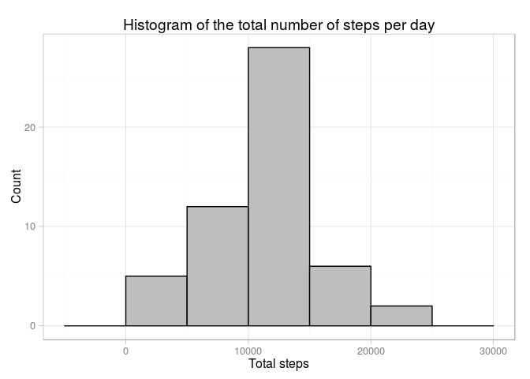

# Reproducible Research: Peer Assessment 1


## Loading and preprocessing the data


```r
raw.data <- read.csv('data/activity.csv')
```


## What is mean total number of steps taken per day?

We can easily calculate this by grouping the data by the date, and them
summing all the steps occuring on that date. The *dplyr* package makes this 
easy to do:


```r
library(dplyr)

total.steps <- raw.data %>% group_by(date) %>% summarise(total = sum(steps))
```

We can quickly examine the data using head:


```r
knitr::kable(head(total.steps))
```


date          total
-----------  ------
2012-10-01       NA
2012-10-02      126
2012-10-03    11352
2012-10-04    12116
2012-10-05    13294
2012-10-06    15420

And we can use *ggplot2* to show a histogram of the total number of steps taken.


```r
library(ggplot2)

create_histogram <- function(data, title) {
    g <- ggplot(data, aes(x = total))
    g <- g + geom_histogram(binwidth = 5000, fill="grey", colour="black")
    g <- g + labs(title = title,
                  x = "Total steps",
                  y = "Count")
    g <- g + theme_light()
    g
}

create_histogram(total.steps, "Histogram of the total number of steps per day")
```

 

To calculate the mean and the median number of steps taken per day, we again
use the *dplyr* package:


```r
summaries <- total.steps %>% summarise(mean = mean(total, na.rm = TRUE),
                                       median = median(total, na.rm = TRUE))
knitr::kable(summaries, digits = 2)
```

     mean   median
---------  -------
 10766.19    10765


## What is the average daily activity pattern?

First, we want to calculate the average number of steps taken per interval
period, across all days:


```r
interval.means <- raw.data %>% 
    group_by(interval) %>% 
    summarise(mean = mean(steps, na.rm = TRUE))
```


```r
g <- ggplot(interval.means, aes(x = interval, y = mean)) 
g <- g + geom_line()
g <- g + labs(title = "Average number of steps per 5 minute time interval",
              x = "Time interval",
              y = "Average number of steps")
g <- g + theme_light()
print(g)
```

 

The interval that has on average the maximum number of steps can be calculated
like so:


```r
filter(interval.means, mean == max(interval.means$mean))
```

```
## Source: local data frame [1 x 2]
## 
##   interval     mean
## 1      835 206.1698
```


## Imputing missing values

The number of rows that contain NA values can be calculated as:

```r
missing <- nrow(filter(raw.data, is.na(steps)))
```

There are 2304 rows with NA values.

We will fill in the missing step data by substituting the mean value for that
particular interval across all days in the data set. These values were
already previously calculated. 


```r
imputed.data <- raw.data

for (i in seq_len(nrow(raw.data))) {
    if (is.na(imputed.data[i,1])) {
        interval <- imputed.data[i,]$interval
        imputed.data[i, 1] <- interval.means[interval.means$interval == interval,]$mean
    }
}
```

Let us again graph this as a histogram:


```r
imputed.total.steps <- imputed.data %>% group_by(date) %>% summarise(total = sum(steps))
create_histogram(imputed.total.steps, 
                 "Histogram of the total number of steps, including imputed")
```

 


```r
imputed.summaries <- imputed.total.steps %>% 
    summarise(mean = mean(total, na.rm = TRUE), 
              median = median(total, na.rm = TRUE))
knitr::kable(imputed.summaries, digits = 2)
```

     mean     median
---------  ---------
 10766.19   10766.19

Mean and median are nearly identical. 

## Are there differences in activity patterns between weekdays and weekends?


```r
imputed.data <- imputed.data %>%
    transform(
        day = factor(ifelse(weekdays(as.POSIXct(date)) %in% c("Saturday", "Sunday"),
                            "WEEKEND", "WEEKDAY"))
        )

knitr::kable(head(imputed.data), digits = 2)
```


 steps  date          interval  day     
------  -----------  ---------  --------
  1.72  2012-10-01           0  WEEKDAY 
  0.34  2012-10-01           5  WEEKDAY 
  0.13  2012-10-01          10  WEEKDAY 
  0.15  2012-10-01          15  WEEKDAY 
  0.08  2012-10-01          20  WEEKDAY 
  2.09  2012-10-01          25  WEEKDAY 

Now calculate average intervals.


```r
day.interval.means <- imputed.data %>%     
    group_by(day, interval) %>% 
    summarise(mean = mean(steps))
```


```r
g <- ggplot(day.interval.means, aes(x = interval, y = mean)) 
g <- g + geom_line()
g <- g + facet_wrap(~ day, nrow = 2)
g <- g + labs(title = "Average number of steps per 5 minute time interval",
              x = "Time interval",
              y = "Average number of steps")
g <- g + theme_light()
print(g)
```

 
